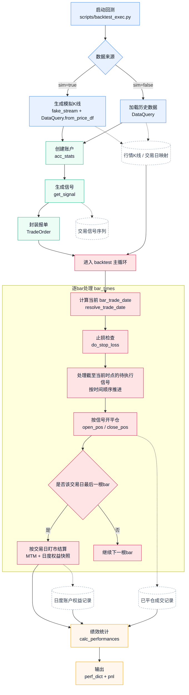

# Quant Trade：一个面向实战的期货量化框架

轻量、模块化、可扩展的期货量化框架，覆盖从数据获取、信号生成、回测仿真到模拟/实盘交易的完整链路。

English version: [README_EN.md](./README_EN.md)

## 功能概览

| 功能 | 说明 |
|------|------|
| **策略回测** | 基于历史 K 线数据，逐 bar 仿真开平仓与账户权益变化 |
| **内置策略** | 均线(ma)、双均线(dma)、动量(mom)、分位数(qtl)、绝对阈值(abs)、均值回归(mr) |
| **风控参数** | 滑点、日内最大回撤熔断、单品种最大持仓上限、账户最低权益下限 |
| **绩效统计** | 年化收益、夏普比率、最大回撤、胜率、盈亏比等 |
| **可视化 UI** | 基于 Streamlit 的参数配置与回测结果浏览 |
| **数据接入** | Tushare API + 本地 MySQL 落库；支持 CSV 导入 |
| **模拟/实盘** | 接入 vn.py CTP/XTP/IB/UFT 网关，SimNow 免费仿真环境 |

## 项目结构

```text
quant_trade/
|- app/                   # Streamlit 可视化页面
|  |- pages/
|     |- backtest.py      # 回测参数配置与结果展示
|     |- data_writer.py   # 行情数据写入
|- config/                # 配置文件
|  |- database_config.json      # 数据库 & Tushare（本地，gitignore）
|  |- database_config.example.json
|  |- broker_config.json        # 券商/接入配置（本地，gitignore）
|  |- broker_config.example.json
|  |- exchange_map.json         # 合约 → 交易所映射
|  |- trading_sessions.json     # 各品种交易时段
|  |- loader.py                 # 统一配置加载
|- core/
|  |- account_statistics.py     # 账户权益、开平仓、止损、风控
|  |- simulation.py             # 回测主循环
|  |- live_adapter.py           # 实盘适配器（LiveAdapter + LiveTrader）
|  |- gen_trade_orders.py       # 信号 → 报单转换
|- scripts/
|  |- backtest_exec.py          # 命令行回测入口
|  |- live_exec.py              # 命令行实盘入口
|  |- get_args.py               # CLI 参数定义
|- get_data.py            # 数据查询、假日历、交易日映射
|- signals.py             # 策略注册与信号生成
`- vnpy_adaptor.py        # vn.py 数据库适配层
```

---

## 快速上手

根据你的需求选择对应路径：

| 目标 | 前提条件 |
|------|---------|
| 纯回测 | MySQL + [Tushare token](https://tushare.pro/register) |
| SimNow 仿真盘 | 以上 + [SimNow 账号](https://www.simnow.com.cn/)（免费注册） |
| 实盘 | 以上 + CTP 期货账号（向期货公司申请） |

### 第一步：启动 MySQL

**方式 A：本机已有 MySQL**

直接使用，执行下方建库语句即可。

**方式 B：Docker 快速启动（推荐新手）**

```bash
docker run -d --name quant-mysql \
  -e MYSQL_ROOT_PASSWORD=root \
  -e MYSQL_DATABASE=vnpy \
  -e MYSQL_USER=fqt_user \
  -e MYSQL_PASSWORD=your_password \
  -p 3306:3306 \
  mysql:8
```

建库 SQL（如使用本机 MySQL）：

```sql
CREATE DATABASE vnpy;
CREATE USER 'fqt_user'@'localhost' IDENTIFIED BY 'your_password';
GRANT ALL PRIVILEGES ON vnpy.* TO 'fqt_user'@'localhost';
FLUSH PRIVILEGES;
```

### 第二步：填写配置

```bash
cp config/database_config.example.json config/database_config.json
```

编辑 `config/database_config.json`：

```json
{
  "db_name": "vnpy",
  "db_user": "fqt_user",
  "db_pwd": "your_password",
  "db_host": "localhost",
  "tushare_token": "your_tushare_token"
}
```

> Tushare token 在 [tushare.pro](https://tushare.pro/register) 注册后免费获取，基础接口无需积分。

### 第三步：安装依赖

```bash
uv sync
uv pip install -e .
```

> 推荐 editable 安装，确保命令行脚本与 Streamlit 页面的导入路径一致。

### 第四步：下载行情数据

```bash
uv run python scripts/data/ts_download.py --symbol CU --start 20200101 --end 20241231
```

或在 Streamlit 数据写入页面操作。

### 第五步：运行回测

命令行：

```bash
# Linux/macOS
uv run bash scripts/test.sh

# Windows
uv run scripts/test.bat
```

Streamlit UI：

```bash
uv run streamlit run app/HomePage.py
```

---

## 模拟/实盘接入（可选）

### 注册 SimNow 仿真账号

1. 前往 [www.simnow.com.cn](https://www.simnow.com.cn/) 免费注册
2. 获得账号、密码和经纪商代码（通常为 9999）

### 填写券商配置

```bash
cp config/broker_config.example.json config/broker_config.json
```

编辑 `config/broker_config.json`，将 `"gateway"` 设为目标接入方式，并填写对应账号


支持的 gateway：

| gateway | 适用场景 | 安装包 |
|---------|---------|--------|
| `CTP` | 国内期货（上期/中金/大商/郑商所），含 SimNow | `vnpy_ctp` |
| `XTP` | 国内证券（股票/ETF），中泰证券 | `vnpy_xtp` |
| `IB` | 境外（Interactive Brokers） | `vnpy_ib` |
| `UFT` | 国内期货（恒生 UFT 柜台） | `vnpy_uft` |

### 启动实盘

```bash
uv run python scripts/live_exec.py
```

---

## 支持策略

详见 [signals.py](./signals.py)。

| 策略名称 | 说明 | 主要参数 |
|----------|------|---------|
| `ma` | 价格与移动均线的偏离方向 | `lag` |
| `dma` | 双均线交叉（金叉/死叉） | `short`, `long` |
| `mom` | 价格动量（收益率符号） | `lag` |
| `qtl` | 价格分位数区间突破 | `lbr`, `ubr` |
| `abs` | 绝对价格阈值 | `level` |
| `mr` | 均值回归（偏离均值超过阈值反向） | `lag`, `threshold` |

## 风控参数

回测和实盘共用一套风控参数，均可通过命令行或 Streamlit UI 配置：

| 参数 | 默认值 | 说明 |
|------|--------|------|
| `--slippage` | `0.0` | 滑点比例（百分比，乘式）。做多开仓 price × (1+s)，做空开仓 price × (1-s) |
| `--max_daily_drawdown` | `0.1` | 日内最大回撤比例（超过则当日停止开新仓，次日 MTM 后自动解除） |
| `--max_position_per_code` | `10` | 单品种最大持仓手数 |
| `--min_balance_ratio` | `0.1` | 账户权益低于初始资金此比例时禁止开新仓 |

## 回测流程（Backtest Flow）

下图对应 scripts/backtest_exec.py 的主流程，用来说明回测中“数据输入 -> 信号生成 -> 交易执行 -> 绩效输出”的链路。



## 交易场景处理规则

- 反手信号：先开先平；先按当前持仓手数全部平仓，再按目标手数尝试开新仓。
- 止损后同向限制：若当日触发过止损，会阻止同方向立即再开；只有一次完整开仓成功后才解除限制。
- 允许部分成交（例如目标 3 手实际仅开成 1~2 手），常见原因是保证金/手续费导致资金不足。
- 夜盘品种的凌晨的止损/结算/绩效计算归属前一交易日，以 `resolve_trade_date` 的映射结果为准。
- 合约结算信息在目标交易日缺失记录时，以最近可用日计算。

## 演示

- 数据写入页面：https://github.com/user-attachments/assets/f7a9627a-bb17-4336-8acd-0cdf18773ce8
- 回测可视化页面：https://github.com/user-attachments/assets/bc1632a8-0c85-4481-847b-8b63528709c3

## Roadmap

- [ ] 主力合约自动识别与滚动换月
- [ ] 多合约组合回测
- [ ] 自动因子挖掘
- [ ] 研报策略模板化接入

## 贡献

欢迎提 Issue / PR / Star。

项目地址：https://github.com/tina-wen/quant_trade
