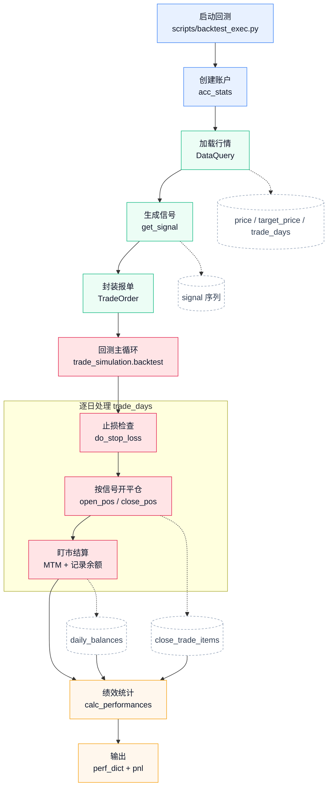

# Quant Trade：一个面向实战的期货回测框架

轻量、模块化、可扩展的期货回测项目。接入 Tushare 与本地 MySQL 后，可快速完成数据落库、信号生成、交易仿真与绩效评估。

English version: [README_EN.md](./README_EN.md)

## 特性

- 策略与回测引擎解耦：策略只负责生成信号，回测只负责执行和统计。
- 多策略内置：均线、双均线、动量、分位数、绝对阈值、均值回归。
- 数据链路完整：支持 CSV/Tushare 数据写入 MySQL。
- 可视化支持：基于 Streamlit 的参数配置与结果浏览页面。
- 指标完备：年化收益、夏普、回撤、胜率、盈亏比等。

## 项目结构

```text
quant_trade/
|- app/                 # Streamlit 页面
|- config/              # 数据库与交易所映射配置
|- core/                # 交易仿真与账户统计核心逻辑
|- scripts/             # 命令行脚本与示例
|- tests/               # 单元/集成测试
|- get_data.py          # 数据查询入口
|- signals.py           # 策略信号生成
`- vnpy_adaptor.py      # 数据库适配层
```

## 快速开始

### 1. 配置 MySQL

```sql
CREATE DATABASE your_database;
CREATE USER 'your_user'@'localhost' IDENTIFIED BY 'your_password';
GRANT ALL PRIVILEGES ON your_database.* TO 'your_user'@'localhost';
FLUSH PRIVILEGES;
```

先复制示例配置文件：

```bash
cp config/database_config.example.json config/database_config.json
```

再编辑本地配置 [config/database_config.json](./config/database_config.json)：

```json
{
  "db_name": "your_database",
  "db_user": "your_user",
  "db_pwd": "your_password",
  "db_host": "localhost",
  "tushare_token": "your_tushare_token"
}
```

### 2. 安装依赖（uv）

```bash
uv sync
uv pip install -e .
```

说明：推荐使用 editable 安装，便于统一命令行脚本、Streamlit 页面与顶层模块的导入路径。

### 3. 运行测试

```bash
uv run pytest tests/
```

### 4. 运行命令行回测示例

Linux/macOS:

```bash
uv run bash scripts/test.sh
```

Windows:

```bat
uv run scripts/test.bat
```

### 5. 启动可视化页面

```bash
uv run streamlit run app/HomePage.py
```

## 支持策略

详见 [signals.py](./signals.py)。

| 策略名称 | 参数说明 |
|----------|----------|
| `ma` | `--lag` |
| `dma` | `--short`, `--long` |
| `mom` | `--lag` |
| `qtl` | `--lbr`, `--ubr` |
| `abs` | `--level` |
| `mr` | `--lag`, `--threshold` |

## 回测流程（Backtest Flow）

下图对应 scripts/backtest_exec.py 的主流程，用来说明回测中“数据输入 -> 信号生成 -> 交易执行 -> 绩效输出”的链路。



## 演示

- 数据写入页面：https://github.com/user-attachments/assets/f7a9627a-bb17-4336-8acd-0cdf18773ce8
- 回测可视化页面：https://github.com/user-attachments/assets/bc1632a8-0c85-4481-847b-8b63528709c3

## Roadmap

- [ ] 多合约组合回测
- [ ] 自动因子挖掘
- [ ] 研报策略模板化接入

## 贡献

欢迎提 Issue / PR / Star。

项目地址：https://github.com/tina-wen/quant_trade

## 常见问题（Troubleshooting）

### 1. 时区比较报错

- 现象：`TypeError: can't compare offset-naive and offset-aware datetimes`
- 原因：行情时间（可能带时区）与交易时段窗口（本地无时区时间）直接比较。
- 处理：在 `get_data.py` 中统一归一化时间（先转本地交易时区，再去除时区信息）。

### 2. 夜盘跨日导致交易日归属变化

- 夜盘品种（如铜）在凌晨的 bar 时间可能归属前一交易日的夜盘。
- 以 `resolve_trade_date` 的映射结果为准，再进行止损/结算/绩效计算。

### 3. 结算信息缺失

- 现象：`no settlement data found for YYYY-MM-DD`
- 原因：合约信息表在目标交易日缺失记录。
- 处理：优先查当日，若缺失则回退到最近可用日（lookback 窗口）继续计算。
