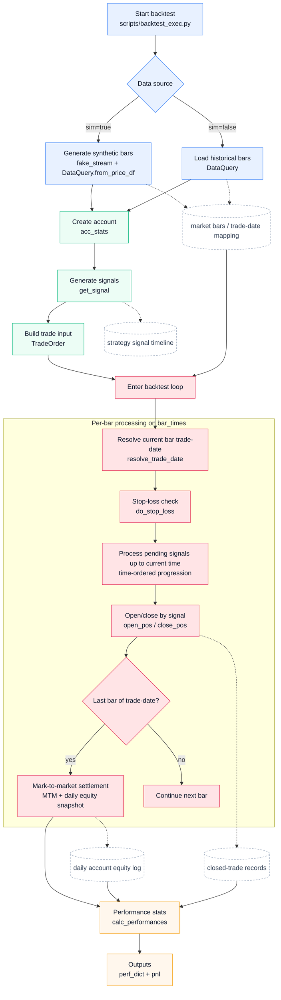

# Quant Trade: A Practical Futures Backtesting Framework

Quant Trade is a lightweight and extensible framework for futures strategy research.
It connects Tushare + MySQL + a modular backtesting engine so you can move from raw data to performance metrics quickly.

Chinese version: [README.md](./README.md)

## Highlights

- Decoupled architecture: strategy generation and trade simulation are separated.
- Built-in strategies: MA, DMA, Momentum, Quantile, Absolute Threshold, Mean Reversion.
- Data pipeline included: import from CSV or Tushare into local MySQL.
- Streamlit UI: convenient pages for data writing and backtest visualization.
- Performance analytics: annual return, Sharpe ratio, drawdown, win rate, and PnL ratio.

## Project Structure

```text
quant_trade/
|- app/                 # Streamlit pages
|- config/              # Database and exchange mapping config
|- core/                # Simulation engine and account statistics
|- scripts/             # CLI scripts and examples
|- tests/               # Unit/integration tests
|- get_data.py          # Data query entry
|- signals.py           # Strategy signal generation
`- vnpy_adaptor.py      # Database adapter
```

## Quick Start

### 1. Configure MySQL

```sql
CREATE DATABASE your_database;
CREATE USER 'your_user'@'localhost' IDENTIFIED BY 'your_password';
GRANT ALL PRIVILEGES ON your_database.* TO 'your_user'@'localhost';
FLUSH PRIVILEGES;
```

First copy the example config:

```bash
cp config/database_config.example.json config/database_config.json
```

Then edit your local config [config/database_config.json](./config/database_config.json):

```json
{
  "db_name": "your_database",
  "db_user": "your_user",
  "db_pwd": "your_password",
  "db_host": "localhost",
  "tushare_token": "your_tushare_token"
}
```

### 2. Install Dependencies with uv

```bash
uv sync
uv pip install -e .
```

Note: editable install is recommended so CLI scripts, Streamlit pages, and top-level modules share a consistent import path.

### 3. Run Tests

```bash
uv run pytest tests/
```

### 4. Run CLI Backtest Example

Linux/macOS:

```bash
uv run bash scripts/test.sh
```

Windows:

```bat
uv run scripts/test.bat
```

### 5. Launch Streamlit UI

```bash
uv run streamlit run app/HomePage.py
```

## Built-in Strategies

See [signals.py](./signals.py).

| Strategy | Parameters |
|----------|------------|
| `ma` | `--lag` |
| `dma` | `--short`, `--long` |
| `mom` | `--lag` |
| `qtl` | `--lbr`, `--ubr` |
| `abs` | `--level` |
| `mr` | `--lag`, `--threshold` |

## Backtest Flow

The diagram below maps to scripts/backtest_exec.py and explains the pipeline from data input to signal generation, trade execution, and performance outputs.



## Trade Execution Rules

- Stop-loss check: `do_stop_loss` runs on every bar; it returns early internally when there is no position.
- Opening from flat: open is attempted only when signal is non-zero and the post-stop-loss re-entry constraint is satisfied.
- Reverse signal: close all current lots first, then attempt to open new lots up to the configured target size.
- Same-direction cooldown after stop-loss: if stop-loss is triggered, immediate same-direction re-entry is blocked; the cooldown is cleared only after one full successful open cycle.
- Open failure handling: when `open_pos` returns `False` (typically insufficient funds due to margin/fee), the current add-position attempt stops.
- Partial position policy: use the current break semantics, meaning partial fills are accepted (for example target 3 lots but only 1-2 lots can be opened), and later close operations use actual held lots.

## Demo

- Data writing page: https://github.com/user-attachments/assets/f7a9627a-bb17-4336-8acd-0cdf18773ce8
- Backtest visualization page: https://github.com/user-attachments/assets/bc1632a8-0c85-4481-847b-8b63528709c3

## Roadmap

- [ ] Multi-symbol portfolio backtesting
- [ ] Automatic factor mining
- [ ] Research-paper strategy templates

## Contributing

Issues and PRs are welcome.

GitHub: https://github.com/tina-wen/quant_trade

## Troubleshooting

### 1. offset-naive vs offset-aware datetime error

- Symptom: `TypeError: can't compare offset-naive and offset-aware datetimes`
- Cause: market timestamps (timezone-aware) are compared against session windows (naive local datetime).
- Fix: normalize datetimes in `get_data.py` before comparisons (convert to local trading timezone, then drop tz).

### 2. Night session and trade-date mapping

- For night-session products (for example copper), bars after midnight may belong to the previous trading day session.
- Trade-date mapping should follow `resolve_trade_date` before stop-loss, settlement, and performance calculations.

### 3. Missing settlement record

- Symptom: `no settlement data found for YYYY-MM-DD`
- Cause: missing contract-info record on that trading date.
- Fix: query exact date first; if missing, fallback to the nearest available prior record within a lookback window.
