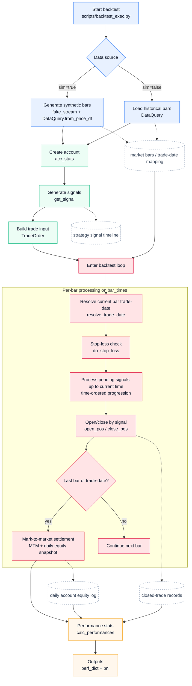

# Quant Trade: A Practical Futures Quantitative Framework

A lightweight, modular, and extensible futures framework covering the full pipeline from data acquisition, signal generation, and backtesting simulation to paper/live trading.

Chinese version: [README.md](./README.md)

## Feature Overview

| Feature | Description |
|---------|-------------|
| **Strategy Backtesting** | Bar-by-bar simulation of open/close orders and account equity based on historical K-line data |
| **Built-in Strategies** | MA, DMA, Momentum, Quantile, Absolute Threshold, Mean Reversion |
| **Risk Controls** | Slippage, daily drawdown circuit breaker, per-symbol position cap, minimum equity ratio |
| **Performance Analytics** | Annualized return, Sharpe ratio, max drawdown, win rate, profit-loss ratio |
| **Streamlit UI** | Parameter configuration and backtest result visualization pages |
| **Data Pipeline** | Tushare API + local MySQL storage; CSV import supported |
| **Paper / Live Trading** | vn.py CTP/XTP/IB/UFT gateways; SimNow free simulation environment |

## Project Structure

```text
quant_trade/
|- app/                   # Streamlit UI pages
|  |- pages/
|     |- backtest.py      # Backtest config and results
|     |- data_writer.py   # Market data import
|- config/                # Configuration files
|  |- database_config.json      # DB & Tushare (local, gitignored)
|  |- database_config.example.json
|  |- broker_config.json        # Broker/gateway config (local, gitignored)
|  |- broker_config.example.json
|  |- exchange_map.json         # Contract → exchange mapping
|  |- trading_sessions.json     # Session windows per product
|  |- loader.py                 # Unified config loading
|- core/
|  |- account_statistics.py     # Account equity, open/close, stop-loss, risk controls
|  |- simulation.py             # Backtest main loop
|  |- live_adapter.py           # Live trading adapter (LiveAdapter + LiveTrader)
|  |- gen_trade_orders.py       # Signal → order conversion
|- scripts/
|  |- backtest_exec.py          # CLI backtest entry point
|  |- live_exec.py              # CLI live trading entry point
|  |- get_args.py               # CLI argument definitions
|- get_data.py            # Data queries, holiday calendar, trade-date mapping
|- signals.py             # Strategy registry and signal generation
`- vnpy_adaptor.py        # vn.py database adapter layer
```

---

## Quick Start

Choose the path that matches your goal:

| Goal | Prerequisites |
|------|--------------|
| Backtesting only | MySQL + [Tushare token](https://tushare.pro/register) |
| SimNow paper trading | Above + [SimNow account](https://www.simnow.com.cn/) (free) |
| Live trading | Above + CTP futures account (from your broker) |

### Step 1: Start MySQL

**Option A: Use an existing MySQL installation**

Run the setup SQL below directly.

**Option B: Docker (recommended for new users)**

```bash
docker run -d --name quant-mysql \
  -e MYSQL_ROOT_PASSWORD=root \
  -e MYSQL_DATABASE=vnpy \
  -e MYSQL_USER=fqt_user \
  -e MYSQL_PASSWORD=your_password \
  -p 3306:3306 \
  mysql:8
```

Setup SQL (if using a local MySQL):

```sql
CREATE DATABASE vnpy;
CREATE USER 'fqt_user'@'localhost' IDENTIFIED BY 'your_password';
GRANT ALL PRIVILEGES ON vnpy.* TO 'fqt_user'@'localhost';
FLUSH PRIVILEGES;
```

### Step 2: Fill in Configuration

```bash
cp config/database_config.example.json config/database_config.json
```

Edit `config/database_config.json`:

```json
{
  "db_name": "vnpy",
  "db_user": "fqt_user",
  "db_pwd": "your_password",
  "db_host": "localhost",
  "tushare_token": "your_tushare_token"
}
```

> Get a free Tushare token at [tushare.pro](https://tushare.pro/register). Basic APIs require no points.

### Step 3: Install Dependencies

```bash
uv sync
uv pip install -e .
```

> Editable install is recommended so CLI scripts and Streamlit pages share a consistent import path.

### Step 4: Download Market Data

```bash
uv run python scripts/data/ts_download.py --symbol CU --start 20200101 --end 20241231
```

Or use the Streamlit data-writing page.

### Step 5: Run a Backtest

CLI:

```bash
# Linux/macOS
uv run bash scripts/test.sh

# Windows
uv run scripts/test.bat
```

Streamlit UI:

```bash
uv run streamlit run app/HomePage.py
```

---

## Paper / Live Trading (Optional)

### Register a SimNow Account

1. Go to [www.simnow.com.cn](https://www.simnow.com.cn/) and register for free
2. Obtain your username, password, and broker ID (usually `9999`)

### Fill in Broker Configuration

```bash
cp config/broker_config.example.json config/broker_config.json
```

Edit `config/broker_config.json`, set `"gateway"` to your target and fill in the credentials

Supported gateways:

| Gateway | Use case | Package |
|---------|----------|---------|
| `CTP` | CN futures (SHFE/CFFEX/DCE/CZCE), including SimNow | `vnpy_ctp` |
| `XTP` | CN equities (stocks/ETFs), CITICS brokerage | `vnpy_xtp` |
| `IB` | International (Interactive Brokers) | `vnpy_ib` |
| `UFT` | CN futures (Hundsun UFT platform) | `vnpy_uft` |

### Start Live Trading

```bash
uv run python scripts/live_exec.py
```

---

## Built-in Strategies

See [signals.py](./signals.py).

| Strategy | Description | Key Parameters |
|----------|-------------|----------------|
| `ma` | Price vs moving average | `lag` |
| `dma` | Dual moving average crossover | `short`, `long` |
| `mom` | Price momentum (return sign) | `lag` |
| `qtl` | Quantile range breakout | `lbr`, `ubr` |
| `abs` | Absolute price threshold | `level` |
| `mr` | Mean reversion (fade deviation) | `lag`, `threshold` |

## Risk Controls

Risk parameters are shared between backtesting and live trading and can be set via CLI or the Streamlit UI:

| Parameter | Default | Description |
|-----------|---------|-------------|
| `--slippage` | `0.0` | Slippage ratio (multiplicative). Long open: price × (1+s); short open: price × (1-s) |
| `--max_daily_drawdown` | `0.1` | Daily drawdown circuit breaker — halts new opens when triggered; resets after MTM |
| `--max_position_per_code` | `10` | Maximum open lots per symbol |
| `--min_balance_ratio` | `0.1` | Blocks new opens when equity falls below this fraction of initial capital |

## Backtest Flow

The diagram below maps to `scripts/backtest_exec.py` and explains the pipeline from data input to signal generation, trade execution, and performance output.



## Trade Execution Rules

- Stop-loss check: `do_stop_loss` runs on every bar; it returns early internally when there is no position.
- Opening from flat: open is attempted only when signal is non-zero and the post-stop-loss re-entry constraint is satisfied.
- Reverse signal: close all current lots first, then attempt to open new lots up to the configured target size.
- Same-direction cooldown after stop-loss: if stop-loss is triggered, immediate same-direction re-entry is blocked; the cooldown is cleared only after one full successful open cycle.
- Open failure handling: when `open_pos` returns `False` (typically insufficient funds due to margin/fee), the current add-position attempt stops.
- Partial position policy: use the current break semantics, meaning partial fills are accepted (for example target 3 lots but only 1-2 lots can be opened), and later close operations use actual held lots.

## Demo

- Data writing page: https://github.com/user-attachments/assets/f7a9627a-bb17-4336-8acd-0cdf18773ce8
- Backtest visualization page: https://github.com/user-attachments/assets/bc1632a8-0c85-4481-847b-8b63528709c3

## Roadmap

- [ ] Dominant contract auto-detection and rolling
- [ ] Multi-symbol portfolio backtesting
- [ ] Automatic factor mining
- [ ] Research-paper strategy templates

## Contributing

Issues and PRs are welcome.

GitHub: https://github.com/tina-wen/quant_trade

## Troubleshooting

### 1. offset-naive vs offset-aware datetime error

- Symptom: `TypeError: can't compare offset-naive and offset-aware datetimes`
- Cause: market timestamps (timezone-aware) compared against session windows (naive local datetime).
- Fix: normalize datetimes in `get_data.py` before comparisons (convert to local trading timezone, then drop tz).

### 2. Night session and trade-date mapping

- For night-session products (e.g. copper), bars after midnight may belong to the previous trading day's session.
- Trade-date mapping should follow `resolve_trade_date` before stop-loss, settlement, and performance calculations.

### 3. Missing settlement record

- Symptom: `no settlement data found for YYYY-MM-DD`
- Cause: missing contract-info record on that trading date.
- Fix: query exact date first; if missing, fall back to the nearest prior record within a lookback window.

### 4. Live connection timeout

- Symptom: `RuntimeError: 连接网关 CTP 超时（30s）`
- Cause: front-end server unavailable outside trading hours, or incorrect address in config.
- Fix: verify you are within trading hours and check `broker_config.json` server addresses.
